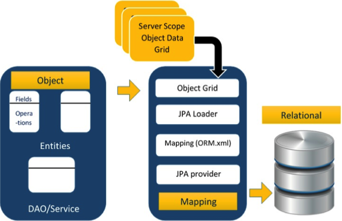

# JPA

<strong>JPA</strong>: Java Persistence API是sun官方提出的Java持久化规。提出主要是为了简化现有的持久化开发工作和整合ORM技术，结束现有的`Hibernate`, `TopLink`, `JDO`等ORM框架各自为营的局面。出现时间为2006. JPA is a collection of classes and methods to persistently store the vast amounts of data into a database, provided by Oracle Corporation. 

>Hibernate ORM is concerned with helping your application to achieve persistence. 
>
>Persistence means that we would like our applications data to outlive the application process. 
>
>RDBMS vs. ODBMS: Relation Database and Object Database.

好处就是：应用程序可以在不修改代码的情况下，在任何JPA环境下运行，真正做到低耦合，可扩展的程序设计。

##1. Where to Use JAP

Here is the structure of standard Java Web Application. 

Programmer follows the 'JPA Provider' framework.

- JPA 1.0 - 2006
- JPA 2.0 - 2009
- JPA 2.2 - 2013

## 2 JPA Provider

`Hibernate`

`EclipseLink`

`Toplink`

`Spring Data JPA`

> 三方面技术：
>
> - ORM映射元数据：JPA支持XML和JDK5.0注释两种元数据的形式，将程序中的对象自动持久化到关系数据库中。元数据描述对象和表之间的映射关系。是为了解决程序的面向对象模型与数据库的关系模型之间互不匹配问题的技术。
> - Java持久化API：Developers don't need to write lots of SQL. 
> - 查询语言

## 3. 开发JPA依赖的JAr包

版本更新的比较快，建议直接参考Hibernate的官方文档。

## 4. JPA 的架构

Class Level Architecture: the core classes and interfaces of Javax.persistence.

## 5. ORM 组件

The core part of this object relational technologies are mapping orm.xml file. 

Main feature of ORM is mapping or building an object to its data in the database. 

It contains three phases: 

- Phase 1: named <strong>Object data</strong>. 
- Phase 2: named as `mapping` or `persistence` phase. 
  - JPA provider: 
  - mapping file
  - JPA loader: the JPA loader works like cache memory, which can load the relational rid data. 
  - Object grid: is a temporary location which store the copy of relational data. All queries against the database is first effected on the data in the object grid. Only after it is committed, it effects the main database. 
- Phase 3: the `Relational Data phase`. It is stored into the database physically. 

Possible question: what are the mechanism of <strong>Object Relation Mapping</strong>?

# JPA 开发

-  首先：创建一个Java Bean，然后通过注解的方式把Java Bean变成一个实体Bean。

